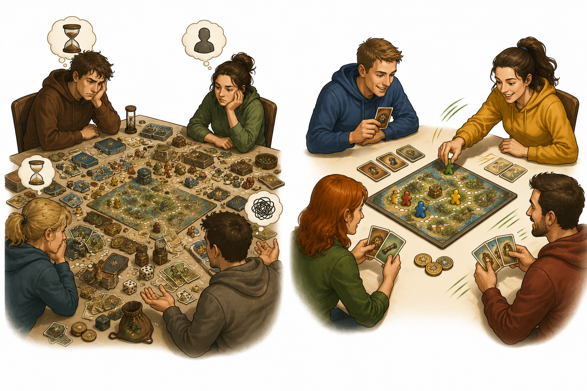
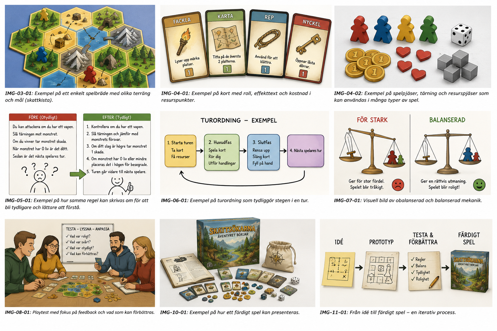

# Kapitel 2: Snabbspel och deras mekaniker

## Varför detta kapitel finns

Nu har vi ett första språk för spelupplevelse: mål, val, spänning och interaktion. Nästa steg är att titta på vilka sorters spel som passar när speltiden ska vara kort.

Ett spel under 30 minuter behöver komma igång snabbt. Spelarna ska förstå vad de gör, börja fatta meningsfulla beslut och känna att spelet rör sig framåt utan lång uppvärmning. Därför är det klokt att välja en speltyp och några få mekaniker som hjälper spelet i rätt riktning.

I det här kapitlet får du en enkel karta över vanliga snabbspel. Målet är inte att memorera alla namn. Målet är att du ska kunna säga: ”Den här typen av spel passar min idé bättre än den där.”

## Lärandemål

Efter kapitlet ska du kunna:

- beskriva vad en spelmekanik är
- känna igen några vanliga typer av snabbspel
- välja en enkel mekanisk riktning för ett första brädspel
- förstå varför kort speltid kräver tydliga beslut och få undantag
- börja koppla **Skattkartan** till en speltyp som passar idén

## Innan vi börjar

I kapitel 1 såg vi att **Skattkartan** ska skapa nyfikenhet, tidspress och vägval. Spelarna ska leta efter en skatt, samla ledtrådar och fatta beslut om risk.

Det betyder inte automatiskt att spelet måste ha ett stort spelbräde, många kort och detaljerade specialregler. För ett första spel är det oftast bättre att börja litet. Vi letar därför efter mekaniker som är enkla att testa, lätta att förklara och snabba att ändra.

## Vad är en spelmekanik?

En spelmekanik är en återkommande regel eller handling som driver spelet framåt.

Det kan vara att dra ett kort, placera en bricka, bjuda på en resurs, välja en handling, flytta en pjäs, rösta, samla symboler eller chansa på ett riskfyllt resultat.

En mekanik är inte samma sak som spelets tema.

- Tema: Spelarna är äventyrare som söker en skatt.
- Mekanik: Spelarna väljer mellan olika vägar och drar farokort.
- Tema: Spelarna driver ett café.
- Mekanik: Spelarna samlar ingredienser och uppfyller beställningar.
- Tema: Spelarna är rymdpiloter.
- Mekanik: Spelarna programmerar rörelser i hemlighet.

Temat hjälper spelet att kännas levande. Mekaniken får spelet att fungera vid bordet.

## Varför snabbspel behöver enkel form

*Figur 2.2: Skillnaden mellan trögt och smidigt speltempo blir tydlig när rundan förenklas.*

Korta spel har inte tid att förklara tjugo undantag. De har inte heller tid att låta spelaren vänta länge innan något intressant händer.

En bra tumregel är:

> Om spelet ska ta under 30 minuter bör spelaren förstå sitt första meningsfulla val inom några minuter.

Det betyder inte att spelet måste vara barnsligt eller tunt. Många korta spel är smarta, taktiska och spännande. Men de brukar vara tydliga i sin form.

För ett nybörjarprojekt är det ofta klokt att välja:

- ett tydligt mål
- en huvudsaklig mekanik
- en enkel turordning
- få komponenttyper
- få specialfall

Om spelet senare känns för tunt kan du lägga till mer. Det är mycket lättare än att börja med för mycket och försöka skära bort hälften.

## Vanliga typer av snabbspel

*Figur 2.1: Sex enkla snabbspelsformer som kan inspirera ett första spel.*

Här är några speltyper som ofta fungerar bra på kort speltid. De kan blandas, men som nybörjare är det smart att börja med en huvudtyp.

### Kortspel

I ett kortspel bär korten mycket av spelets information. Korten kan vara handlingar, platser, resurser, hinder, personer eller mål.

Kortspel passar bra när du vill ha variation utan att bygga ett stort spelbräde. Du kan skapa många situationer genom att blanda och dra kort.

Fördelar:

- enkla att prototypa med lappar eller tomma kort
- lätta att ändra mellan tester
- bra för överraskningar och variation

Risker:

- för mycket text på korten kan göra spelet långsamt
- många olika korteffekter kan bli svåra att balansera
- spelare kan behöva läsa mycket innan de förstår sina val

I **Skattkartan** skulle kort kunna vara ledtrådar, faror, utrustning eller platser.

### Brick- och kartspel

I ett brick- eller kartspel byggs spelområdet ofta av rutor, brickor, platser eller vägar. Spelarna rör sig, placerar saker eller upptäcker nya delar av kartan.

Den här typen passar bra när plats och rörelse är viktiga. Den passar därför naturligt för äventyr och skattjakter.

Fördelar:

- lätt att se var spelarna är
- vägval blir konkreta
- upptäckande känns tydligt

Risker:

- kartan kan bli för stor
- rörelse kan bli långsam om varje steg tar tid
- spelare kan hamna långt från det roliga

I **Skattkartan** kan kartan börja som bara nio rutor: läger, djungel, flod, berg, ruiner och några okända platser.

### Bluff- och förhandlingsspel

I bluffspel vet spelarna inte alltid vem som talar sanning. I förhandlingsspel försöker de byta, övertala eller påverka varandra.

Den här typen kan skapa mycket skratt och stark interaktion på kort tid, men den kräver ofta att spelarna gillar socialt spel.

Fördelar:

- hög interaktion
- få komponenter kan räcka
- varje spelomgång kan kännas annorlunda

Risker:

- blyga spelare kan känna sig obekväma
- reglerna kan vara enkla men situationerna svåra att styra
- spelet kan bero mycket på gruppens personlighet

I **Skattkartan** skulle en lätt bluffdel kunna vara att spelare ibland får hemliga ledtrådar och kan välja hur mycket de vill avslöja.

### Samarbetsspel

I ett samarbetsspel försöker spelarna vinna tillsammans mot spelet. De kanske kämpar mot tid, hot, resurser eller ett scenario som blir farligare.

Samarbetsspel passar bra när du vill skapa gemensam problemlösning och diskussion.

Fördelar:

- spelare kan hjälpa varandra
- bra för äventyrskänsla
- förlust kan kännas mindre hård eftersom gruppen förlorar tillsammans

Risker:

- en erfaren spelare kan börja bestämma åt alla
- spelet behöver ett tydligt motstånd
- det kan vara svårt att göra utmaningen lagom svår

I **Skattkartan** skulle alla kunna vara en expedition som måste hitta skatten innan stormen kommer. Då blir spelet mer gemensamt än tävlingsinriktat.

### Draftingspel

I drafting väljer spelare något ur ett begränsat utbud, ofta kort eller brickor, och skickar vidare eller fyller på alternativen. Det viktiga är att valet påverkas av vad andra kan vilja ha.

Drafting passar bra när du vill skapa många små beslut utan långa regler.

Fördelar:

- tydliga val varje runda
- spelare bryr sig om vad andra tar
- bra för kort speltid

Risker:

- kan kännas abstrakt om temat inte hjälper till
- nya spelare kan ha svårt att värdera alternativen
- för många alternativ gör varje val långsamt

I **Skattkartan** kan spelarna välja mellan synliga utrustningskort: rep, kompass, fackla eller extra proviant. Om du tar repet får någon annan inte det.

### Push-your-luck-spel

Push-your-luck betyder ungefär ”pressa lyckan”. Spelaren får välja om hen vill stanna med en säker vinst eller fortsätta och riskera att förlora något.

Det här är en mycket användbar mekanik i korta spel eftersom den snabbt skapar spänning.

Fördelar:

- lätt att förstå
- skapar dramatik direkt
- passar bra med risk och belöning

Risker:

- för mycket slump kan kännas orättvist
- spelaren måste kunna påverka risken på något sätt
- om belöningarna är svaga blir valet ointressant

I **Skattkartan** passar push-your-luck mycket bra. En spelare kan fortsätta in i ruinen för att leta fler ledtrådar, men varje extra steg ökar risken att väcka en fälla eller förlora tid.

## Att välja huvudmekanik för ditt första spel

När du gör ditt första spel är frågan inte: ”Vilken mekanik är bäst?”

Frågan är:

> Vilken mekanik hjälper spelaren få den upplevelse jag vill skapa?

Om du vill skapa misstänksamhet kan bluff vara rätt. Om du vill skapa upptäckt kan kartbrickor vara rätt. Om du vill skapa nervös risk kan push-your-luck vara rätt. Om du vill skapa gemensam problemlösning kan samarbete vara rätt.

För **Skattkartan** vill vi ha:

- nyfikenhet
- vägval
- tidspress
- risk och belöning
- kort speltid

Det pekar mot en kombination av kartspel och push-your-luck. Men vi håller kombinationen enkel:

- en liten karta
- några ledtrådskort
- några farokort
- en tidsmätare
- tydliga vägval

Vi väntar med avancerade specialförmågor, långa utrustningslistor och många undantag.

## Exempel: Skattkartan får en första mekanisk riktning

Nu kan vi formulera **Skattkartan** lite tydligare.

| Del | Första beslut |
|---|---|
| Speltyp | Litet kart- och äventyrsspel |
| Huvudmekanik | Vägval på karta |
| Stödmekanik | Push-your-luck vid farliga platser |
| Spänning | Farokort, okända platser och begränsad tid |
| Interaktion | Spelarna tävlar om ledtrådar och kan ibland blockera vägar |
| Speltid | Målet är 20–30 minuter |

Det här är fortfarande inte en färdig regeluppsättning. Men nu har vi en riktning. När vi senare bygger prototypen vet vi vad vi ska testa först: om vägval och riskbeslut faktiskt känns roliga.

## Vanliga misstag

- **Misstag: För många mekaniker läggs in direkt.**
  - Varför det händer: Varje ny idé känns rolig i stunden.
  - Hur man undviker det: Välj en huvudmekanik och högst en stödmekanik i första prototypen.

- **Misstag: Temat får ersätta mekaniken.**
  - Varför det händer: Det är lättare att beskriva världen än att beskriva besluten.
  - Hur man undviker det: Skriv vad spelaren gör på sin tur, inte bara vad spelet handlar om.

- **Misstag: Spelet tar längre tid än tänkt.**
  - Varför det händer: Små regler och undantag samlas snabbt på hög.
  - Hur man undviker det: Testa tidigt med få komponenter och sätt en enkel tidsgräns.

- **Misstag: Spelaren har för många alternativ på en gång.**
  - Varför det händer: Designern vill ge frihet.
  - Hur man undviker det: Börja med två eller tre tydliga alternativ och bygg därifrån.

## Övningar

### Övning 1: Välj en huvudtyp

Välj en huvudtyp för din spelidé:

- kortspel
- brick- eller kartspel
- bluff- eller förhandlingsspel
- samarbetsspel
- draftingspel
- push-your-luck-spel
- annan enkel form

Skriv sedan en mening:

> Mitt spel är främst ett ... eftersom spelaren ska uppleva ...

Exempel:

> Mitt spel är främst ett kartspel eftersom spelaren ska uppleva upptäckt och smarta vägval.

### Övning 2: Välj en huvudmekanik

Besvara frågan:

> Vad gör spelaren om och om igen i mitt spel?

Exempel:

- väljer väg
- drar kort
- samlar symboler
- byter resurser
- chansar på fler belöningar
- placerar brickor
- röstar eller bluffar

Skriv bara en huvudmekanik för tillfället.

### Övning 3: Ta bort en mekanik

Skriv ner tre mekaniker du skulle kunna tänka dig att använda. Välj sedan bort minst en av dem.

Det kan kännas tråkigt, men det är en viktig designvana. Ett kort spel blir ofta bättre när det gör färre saker tydligare.

### Övning 4: Testa 30-minutersfrågan

Svara på de här frågorna:

| Fråga | Ditt svar |
|---|---|
| Vad ska spelaren förstå under första minuten? | |
| Vilket är spelarens första meningsfulla val? | |
| Vad kan göra spelet för långsamt? | |
| Vilken regel kan du vänta med till senare? | |

## Snabb sammanfattning

- En spelmekanik är en återkommande regel eller handling som driver spelet framåt.
- Korta spel behöver tydliga beslut, få undantag och snabb start.
- Vanliga snabbspelsformer är kortspel, kartspel, bluffspel, samarbetsspel, drafting och push-your-luck.
- Du behöver inte välja den mest originella mekaniken. Du behöver välja en mekanik som stöder rätt spelupplevelse.
- **Skattkartan** får tills vidare formen av ett litet kart- och äventyrsspel med push-your-luck-inslag.

## Reflektionsfrågor

1. Vilken speltyp passar bäst med känslan du vill skapa?
2. Vilken mekanik skulle spelaren förstå snabbast?
3. Vilken mekanik riskerar att göra spelet onödigt stort?
4. Vilket beslut vill du att spelaren ska fatta flera gånger under spelet?
5. Om spelet måste spelas på 20 minuter, vad behöver du förenkla?

## Nästa steg

Nu har vi valt en möjlig form för spelet. I nästa kapitel går vi från allmän speltyp till konkret spelidé. Då ska vi formulera spelets kärna, begränsa omfånget och se till att idén är liten nog att faktiskt bygga.
