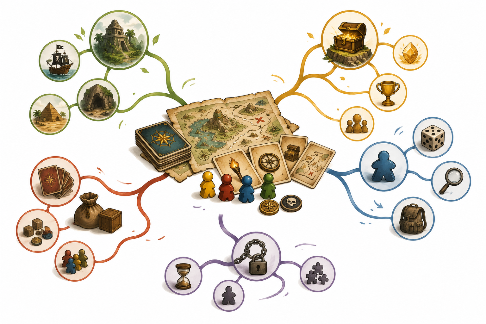

# Kapitel 3: Hitta din spelidé

## Varför detta kapitel finns

Nu har du sett vad som gör spel engagerande och vilka mekaniker som ofta passar korta spel. Nästa steg är att välja en idé som faktiskt går att bygga.

Många första brädspel blir för stora. Man vill ha en värld, många karaktärer, massor av kort, hemliga uppdrag, avancerade strider och flera olika sätt att vinna. Det kan vara roligt att fantisera om, men svårt att testa. Ett bra första spel börjar hellre litet.

I det här kapitlet ska vi därför göra tre saker: hitta en lockande spelidé, välja en kärnmekanik och begränsa spelets scope så att det kan bli färdigt.

## Lärandemål

Efter kapitlet ska du kunna:

- formulera en enkel spelidé i en eller två meningar
- skilja mellan tema och mekanik
- välja en kärnmekanik som passar ett spel under 30 minuter
- begränsa ett spelprojekt så att det går att prototypa
- skriva en första konceptbeskrivning för ditt eget spel

## Innan vi börjar

I kapitel 1 pratade vi om mål, val, spänning och interaktion. I kapitel 2 gick vi igenom mekaniker, alltså återkommande regler eller handlingar som driver spelet framåt.

Nu ska vi använda de begreppen praktiskt. En spelidé blir starkare när du kan svara på fyra frågor:

1. Vad försöker spelaren uppnå?
2. Vilka intressanta val gör spelaren?
3. Var finns spänningen?
4. Vilken mekanik återkommer under spelet?

Du behöver inte ha perfekta svar direkt. I början räcker det med fungerande arbetssvar.

## Tema och mekanik

*Figur 3.1: En idékarta hjälper dig se hur tema, mål, spelarmoment, komponenter och begränsningar hänger ihop.*

Ett vanligt nybörjarmisstag är att börja med bara ett tema.

“Jag vill göra ett spel om pirater” är en bra start, men det är inte ännu ett spel. Det säger vad spelet handlar om, men inte vad spelarna gör.

Ett tema är spelets yta och känsla: pirater, skattjakt, rymdstationer, caféer, detektivarbete eller skogsvandring.

En mekanik är det spelarna faktiskt gör om och om igen: dra kort, välja väg, samla resurser, byta saker, chansa, flytta brickor eller rösta.

Båda behövs, men de gör olika jobb.

| Fråga | Tema svarar på | Mekanik svarar på |
|---|---|---|
| Vad känns spelet som? | Äventyr i en djungel | Utforska en karta |
| Vad föreställer komponenterna? | Skatter, tempel och fällor | Kort, markörer och platser |
| Vad gör spelaren? | Letar efter en gömd skatt | Väljer väg och tar risker |
| Var finns spänningen? | Farliga ruiner | Okända farokort och begränsad tid |

Ett starkt första koncept kopplar ihop tema och mekanik på ett enkelt sätt.

Exempel:

- Tema: Skattjakt i djungeln
- Mekanik: Vägval på karta och riskbeslut
- Enkel idé: Spelarna utforskar en karta, samlar ledtrådar och försöker hitta skatten innan tiden tar slut.

Det är fortfarande inte ett färdigt spel, men det är tillräckligt konkret för att börja designa.

## Börja med en spelmening

En spelmening är en kort beskrivning av spelet. Den är inte reklamtext. Den är ett arbetsverktyg.

En bra spelmening kan följa den här formen:

> Spelarna är [roll] som försöker [mål] genom att [huvudhandling], men de måste hantera [hinder eller risk].

Några exempel:

- Spelarna är upptäcktsresande som försöker hitta en skatt genom att utforska en karta, men de måste hantera faror och begränsad tid.
- Spelarna är caféägare som försöker servera flest nöjda gäster genom att planera sina beställningar, men råvarorna tar snabbt slut.
- Spelarna är rymdmekaniker som försöker reparera ett skepp genom att samarbeta, men nya problem uppstår varje runda.
- Spelarna är bedragare på en marknad som försöker sälja falska varor genom att bluffa, men andra spelare kan avslöja dem.

Målet är inte att meningen ska låta imponerande. Målet är att den ska hjälpa dig fatta designbeslut.

Om spelmeningen blir väldigt lång är spelet troligen för stort.

## Välj en kärnmekanik

Kärnmekaniken är den viktigaste återkommande handlingen i spelet. Den behöver inte vara unik. Den behöver bara vara tydlig och passa upplevelsen.

För ett första snabbspel är det klokt att välja en kärnmekanik som är lätt att testa.

Exempel på lämpliga kärnmekaniker:

| Kärnmekanik | Passar när du vill att spelet ska handla om | Risk för nybörjare |
|---|---|---|
| Vägval på karta | Utforskning, jakt, flykt, äventyr | Kartan blir för stor |
| Kortdragning | Överraskning, variation, snabba händelser | För många korttyper |
| Push-your-luck | Spänning, risk, chansning | För slumpigt om inget val finns |
| Samla och byta resurser | Planering, ekonomi, byggande | För många resurser |
| Bluff och avslöjande | Social spänning, misstänksamhet | Otydliga regler kring information |
| Samarbete mot tid | Gemensamt problem, stress, lagkänsla | En spelare styr alla beslut |

För Skattkartan väljer vi:

- Kärnmekanik: vägval på en liten karta
- Stödmekanik: push-your-luck vid farliga platser
- Huvudkänsla: kort äventyr med risk, upptäckt och tidspress

Det betyder att spelet inte ska börja med stridssystem, utrustningsbutiker, nivåer, yrken, magiska föremål och långa händelsetabeller. Sådant kan vara roligt senare, men det stör första prototypen.

## Begränsa spelets scope

Scope betyder hur stort och omfattande spelprojektet är.

Ett litet scope gör spelet lättare att bygga, testa och förbättra. Ett stort scope gör ofta att spelet fastnar i idéstadiet.

För ett spel under 30 minuter kan du använda den här tumregeln:

- få komponenttyper
- få handlingar per tur
- få undantag
- tydligt slutvillkor
- kort startsträcka
- en huvudidé som bär spelet

Det betyder inte att spelet måste vara tråkigt. Tvärtom: begränsningar hjälper dig hitta det som faktiskt är roligt.

### Scope-testet

Svara ja eller nej på frågorna:

1. Kan en ny spelare förstå grundidén på under två minuter?
2. Kan du bygga första versionen med papper, penna och enkla markörer?
3. Kan en spelrunda testas på under 30 minuter?
4. Har spelet högst tre huvudhandlingar i första versionen?
5. Finns det ett tydligt mål?
6. Vet du när spelet slutar?

Om du svarar nej på flera frågor bör du minska scope innan du bygger prototypen.

## Exempel: Skattkartan får sin första konceptbeskrivning

Nu gör vi Skattkartan mer konkret.

### Spelmening

Spelarna är äventyrare som försöker hitta en gömd skatt genom att utforska en liten karta, samla ledtrådar och ta risker innan tiden tar slut.

### Tänkta komponenter

Första versionen behöver bara enkla komponenter:

- en liten karta med platser
- spelarpjäser eller markörer
- ledtrådsmarkörer
- farokort
- en enkel tidsmätare
- skatten som dold markör eller kort

Det är frestande att lägga till utrustningskort, olika äventyrare, specialförmågor och händelser direkt. Vi väntar med det.

### Första mål

Spelets första mål blir:

> Hitta skatten och återvänd till lägret innan tiden tar slut.

Det målet skapar naturliga val:

- Ska jag utforska en okänd plats?
- Ska jag ta en farlig genväg?
- Ska jag samla fler ledtrådar eller chansa?
- Ska jag försöka hinna tillbaka nu?

### Första scopegräns

Skattkartan får följande begränsningar i första versionen:

- 2–4 spelare
- cirka 20–30 minuter
- liten karta, ungefär 10–12 platser
- en handling per tur
- inga individuella specialförmågor i första prototypen
- inga stridsregler
- faror löses med enkla kort eller enkla symboler

Det här räcker för att skapa ett spelbart första försök.

## Från idélista till val

Du kommer troligen att ha flera idéer. Det är bra. Men välj inte den mest episka idén först. Välj den idé som går att testa.

Ett enkelt sätt är att poängsätta idéerna från 1 till 3:

| Fråga | 1 poäng | 2 poäng | 3 poäng |
|---|---|---|---|
| Är idén lätt att förklara? | Svår | Ganska lätt | Mycket lätt |
| Går den att prototypa snabbt? | Kräver mycket | Kräver en del | Kräver lite |
| Passar den under 30 minuter? | Tveksamt | Kanske | Ja |
| Har den intressanta val? | Oklart | Några | Tydliga |
| Känns den rolig för dig? | Lite | Ganska | Mycket |

Den bästa första idén är inte alltid den med störst värld. Det är ofta den där du snabbt kan sätta dig vid bordet och se vad som händer.

## Vanliga misstag

### Misstag 1: Idén är bara ett tema

“Ett spel om drakar” räcker inte. Lägg till vad spelarna gör.

Bättre: “Spelarna är drakskötare som väljer vilka ägg de ska skydda, men varje val gör boet mer riskabelt.”

### Misstag 2: För många mekaniker från början

Många nya designers lägger in allt de gillar: kortdragning, auktion, karta, strid, resurser, handel och hemliga roller.

Välj en kärnmekanik först. Lägg bara till en stödmekanik om den verkligen hjälper huvudupplevelsen.

### Misstag 3: Spelet börjar för stort

Om första prototypen kräver 200 kort är den förmodligen för stor.

Börja med 12 kort. Eller 20. Eller inga kort alls, om du kan testa idén med lappar.

### Misstag 4: Otydligt slut

Ett kort spel behöver ett tydligt slut. Annars drar det lätt ut på tiden.

Exempel på tydliga slut:

- någon når ett visst antal poäng
- tidsmätaren tar slut
- en skatt hittas
- en kortlek tar slut
- ett uppdrag lyckas eller misslyckas

### Misstag 5: Du försöker vara unik för tidigt

Ditt första mål är inte att skapa världens mest originella spel. Ditt första mål är att skapa ett spel som fungerar.

Unikhet kan växa fram när du testar, förenklar och förbättrar.

## Övningar

### Övning 1: Skriv fem spelmeningar

Skriv fem olika spelmeningar med formen:

> Spelarna är [roll] som försöker [mål] genom att [huvudhandling], men de måste hantera [hinder eller risk].

Välj gärna enkla teman:

- skattjakt
- marknad
- rymdskepp
- bibliotek
- restaurang
- överlevnad i skogen
- magisk skola
- tågresa

Markera den mening som känns lättast att prototypa.

### Övning 2: Hitta tema och mekanik

Välj en av dina spelmeningar och fyll i:

| Del | Ditt svar |
|---|---|
| Tema | |
| Kärnmekanik | |
| Stödmekanik, om någon | |
| Spelarens mål | |
| Spänning | |
| Tydligt slut | |

Om du har svårt att fylla i kärnmekanik eller tydligt slut behöver idén bli mer konkret.

### Övning 3: Gör scope-testet

Svara på scope-testets sex frågor för din idé.

Skriv sedan en sak du ska ta bort eller skjuta upp till senare.

Exempel:

- “Jag tar bort specialförmågor i första versionen.”
- “Jag väntar med händelsekort.”
- “Jag gör kartan mindre.”
- “Jag använder bara tre resurser, inte sju.”

### Fördjupning: Välj bort med flit

Skriv en lista med fem saker som vore roliga att ha i spelet men som inte ska vara med i första prototypen.

Det här är inte ett misslyckande. Det är designarbete.

## Snabb sammanfattning

- En spelidé behöver mer än ett tema. Den behöver också något spelarna gör.
- Tema beskriver känsla och miljö. Mekanik beskriver återkommande handlingar och regler.
- En spelmening hjälper dig se om idén är tydlig.
- Kärnmekaniken är spelets viktigaste återkommande handling.
- Scope avgör hur lätt spelet är att bygga, testa och förbättra.
- Ett bra första spel är hellre litet och testbart än stort och oklart.

## Quiz och reflektionsfrågor

1. Vad är skillnaden mellan tema och mekanik?
2. Varför är det ofta klokt att välja en enkel kärnmekanik i första prototypen?
3. Nämn två tecken på att ett spel har för stort scope.
4. Vad gör en spelmening användbar?
5. Vilken del av din egen spelidé känns mest osäker just nu?
6. Vad kan du ta bort från din idé utan att förstöra huvudupplevelsen?

## Nästa steg

Nu har du en tydligare spelidé. I nästa kapitel ska vi forma spelets kärna: turordning, mål, handlingar och spelarinteraktion. Då börjar idén bli ett faktiskt regelsystem som går att spela.
