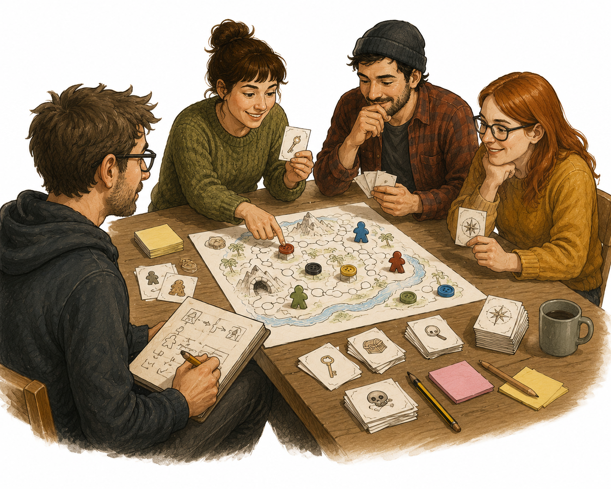

# Kapitel 7: Testspela smart

## Varför detta kapitel finns

Nu finns Skattkartan som en enkel prototyp. Det betyder inte att spelet är färdigt. Det betyder att spelet äntligen kan börja prata tillbaka.

När du testspelar får du svar på sådant som inte går att tänka fram vid skrivbordet. Förstår spelarna målet? Vet de vad de får göra? Blir de nyfikna, stressade, förvirrade eller uttråkade? Tar spelet femton minuter, trettio minuter eller mycket längre än du trodde?

Det här kapitlet handlar om att testspela utan att försvara spelet. Du ska inte bevisa att din idé är bra. Du ska samla information som gör nästa version bättre.

## Lärandemål

Efter kapitlet ska du kunna:

- förklara vad ett playtest är och vad det inte är
- välja rätt mål för en testspelning
- observera spelare utan att styra dem för mycket
- ställa frågor som ger användbar feedback
- omvandla observationer till konkreta designbeslut

## Innan vi börjar

I förra kapitlet byggde vi en första prototyp. Den var medvetet enkel: platsbrickor, ledtrådskort, farokort, spelarpjäser, tidsmätare och ett regelblad.

Det räcker för ett första test. Faktum är att det ofta är bättre att testa för tidigt än för sent. Ju längre du väntar, desto mer fäst blir du vid detaljer som kanske ändå behöver ändras.

Kom ihåg: en testspelning är inte en premiär. Det är ett arbetsmöte med spelet.

## Vad ett playtest är

Ett playtest är en spelomgång där målet är att lära sig något om spelet.

Det är skillnad på att spela för nöje och att testspela. När du spelar för nöje vill du helst att allt ska flyta. När du testspelar vill du upptäcka var spelet skaver.

Ett bra playtest kan visa att:

- reglerna är otydliga
- en handling nästan aldrig väljs
- spelet tar längre tid än tänkt
- spelarna inte förstår vad som är viktigt
- ett visst kort är för starkt eller för svagt
- spelet är roligt på ett annat sätt än du trodde

Det sista är viktigt. Testspelning handlar inte bara om att hitta fel. Ibland upptäcker du att spelarna gillar något du själv trodde var en liten detalj. Då kan den detaljen bli större i nästa version.

## Bestäm vad du testar

Ett vanligt nybörjarmisstag är att vilja testa allt på en gång.

Det går, men det blir ofta rörigt. Efteråt har du många åsikter, men svårt att veta vad du ska ändra.

Inför varje testspelning bör du välja ett tydligt testmål. Ett testmål är den viktigaste frågan du vill få svar på.

Exempel på testmål:

- Förstår spelarna vad de ska göra på sin tur?
- Känns tidsmätaren lagom pressande?
- Är valet mellan att söka och utforska intressant?
- Tar spelet under 30 minuter?
- Skapar farokorten spänning utan att kännas orättvisa?

För Skattkartans första playtest är det klokt att börja enkelt:

> Testmål: Går spelet att spela från start till slut utan att designern behöver förklara varje steg?

Det är ett mycket bra första testmål, eftersom det avslöjar både regelproblem, komponentproblem och otydliga val.

## Tre roller vid testbordet

*Figur 7.1: Ett enkelt playtestbord där designern observerar och antecknar medan andra spelar.*

Vid en testspelning finns ofta tre roller.

Den första rollen är spelaren. Spelarens uppgift är att försöka spela spelet på riktigt. Spelaren behöver inte vara snäll mot designen, men ska försöka följa reglerna så gott det går.

Den andra rollen är spelledaren eller regelhjälpen. I tidiga tester kan du som designer behöva svara på frågor. Men målet är att svara så lite som möjligt, särskilt om du vill testa regeltexten.

Den tredje rollen är observatören. Det är den viktigaste rollen för dig som designer. Du tittar på vad som händer, antecknar och försöker förstå spelarnas beteende.

När du själv har designat spelet vill du gärna prata. Förklara. Försvara. Föreslå strategier. Stoppa dig själv. Ju mer du styr spelarna, desto mindre får du veta om spelet.

## Så observerar du utan att störa

En bra observation fokuserar på vad spelarna gör, inte bara på vad de säger.

Skriv till exempel:

- “Anna frågade tre gånger vad vila gör.”
- “Ingen använde sök-handlingen under de första fyra rundorna.”
- “Spelarna skrattade när farokortet kom upp.”
- “Tidsmätaren glömdes bort två gånger.”
- “Omgången tog 42 minuter.”

Det är mer användbart än:

- “Reglerna är dåliga.”
- “Sök är tråkigt.”
- “Spelet är för långt.”
- “Farorna fungerar nog.”

Försök skilja observation från tolkning.

Observation: “Ingen valde att vila.”

Möjlig tolkning: Vila är för svag, för otydlig eller inte relevant tillräckligt tidigt.

En observation kan ha flera möjliga förklaringar. Därför ska du inte ändra för snabbt efter en enda händelse. Samla först mönster.

## Anteckningsmall för playtest

Du behöver inte skriva långt. En enkel mall räcker.

| Del | Anteckning |
|---|---|
| Datum | När testet gjordes |
| Version | Vilken prototyp som testades |
| Spelare | Antal och erfarenhet |
| Testmål | Vad du ville undersöka |
| Speltid | Faktisk tid från start till slut |
| Regelstopp | Var spelarna fastnade |
| Oanvända val | Handlingar eller komponenter som inte användes |
| Roliga ögonblick | När spelet verkade fungera |
| Problem | Det som störde flödet |
| Nästa ändring | 1–3 saker att ändra före nästa test |

Lägg märke till sista raden. Efter ett test ska du inte ändra tjugo saker. Välj hellre några få viktiga ändringar. Då vet du vad som faktiskt påverkade nästa test.

## Frågor efter testet

När spelet är färdigspelat kan du ställa frågor. Gör det efteråt, inte mitt i varje beslut. Under spelet vill du se naturligt beteende.

Bra frågor är öppna och konkreta:

- Vad försökte du göra i början av spelet?
- När kände du att du förstod vad spelet gick ut på?
- Vilket val kändes mest intressant?
- Vilket val kändes minst användbart?
- Var det någon regel du behövde läsa flera gånger?
- När kändes spelet långsamt?
- Vad trodde du skulle hända som inte hände?

Mindre bra frågor leder spelaren mot ett svar:

- Tyckte du inte att farokorten var roliga?
- Visst var tidsmätaren spännande?
- Skulle spelet bli bättre om jag lade till fler föremål?

De frågorna handlar ofta mer om din egen idé än om spelarens upplevelse.

En hjälpsam tumregel är att fråga om upplevelser innan du frågar om lösningar. Spelare är ofta bra på att beskriva vad de kände. De är inte alltid lika bra på att designa lösningen åt dig.

## Exempel: första playtest av Skattkartan

Vi tänker oss att tre personer testar Skattkartan.

Testmålet är:

> Kan spelarna spela en hel omgång med regelbladet som stöd?

Under testet antecknar du:

| Observation | Möjlig betydelse |
|---|---|
| Spelarna frågar ofta vad skillnaden är mellan utforska och söka. | Handlingarna behöver tydligare namn eller förklaring. |
| Tidsmarkören flyttas bara när någon kommer ihåg det. | Tidsregeln behöver ligga tydligare i turens steg. |
| En spelare samlar många ledtrådar men vet inte när skatten får hittas. | Skattregeln är för otydlig. |
| Farokorten skapar skratt och oro. | Riskmomentet fungerar lovande. |
| Omgången tar 38 minuter. | Spelet är för långt för målet under 30 minuter. |

Efter testet ställer du några frågor. Spelarna säger att temat är lätt att förstå, men att de ofta glömde vad varje handling gjorde. De gillade farokorten, men tyckte att vissa rundor kändes långsamma.

Då kan nästa ändringar vara:

1. Skriv om turöversikten så tidsmarkören alltid flyttas i sista steget.
2. Gör skillnaden mellan utforska och söka tydligare.
3. Minska tidsbanan eller kartans storlek för att komma närmare 30 minuter.

Lägg märke till att vi inte lägger till nya saker än. Vi förbättrar först det som redan finns.

## När ska du avbryta ett test?

Ibland går ett playtest så snett att det inte är värt att spela klart.

Du kan avbryta om:

- spelarna inte kan starta utan lång muntlig förklaring
- en regel gör att spelet låser sig
- spelet uppenbart inte kan ta slut
- alla spelare sitter fast utan meningsfulla val
- testmålet redan är besvarat

Att avbryta är inte ett misslyckande. Det är information. Om testet visar efter tio minuter att reglerna inte går att använda, har du lärt dig något viktigt.

Säg gärna:

> “Jag tror vi har hittat det jag behövde se. Vi stoppar här och jag bygger om den här delen.”

Det är bättre än att tvinga alla genom en dålig timme.

## Från feedback till ändring

Efter ett test har du ofta tre sorters material:

- observationer
- spelarnas kommentarer
- dina egna idéer

Blanda inte ihop dem för snabbt.

Börja med att skriva en kort sammanfattning:

1. Vad fungerade?
2. Vad fungerade inte?
3. Vad är viktigast att testa nästa gång?

Sedan väljer du 1–3 ändringar.

För Skattkartan kan sammanfattningen efter första testet bli:

- Fungerade: temat, farokorten och känslan av att kartan växer.
- Fungerade inte: handlingarna är otydliga, tidsmarkören glöms, speltiden blev för lång.
- Nästa test: undersöka om en tydligare turöversikt och kortare karta ger bättre tempo.

Det här gör utvecklingen lugnare. Du behöver inte lösa hela spelet på en gång.

## Vanliga misstag

### Misstag: Du förklarar för mycket under testet

Varför det händer: Du vill att spelarna ska få se spelet från sin bästa sida.

Hur du undviker det: Bestäm i förväg när du får hjälpa till. Om du testar regeltexten ska spelarna först försöka själva.

### Misstag: Du tar all feedback bokstavligt

Varför det händer: Spelare föreslår ofta lösningar direkt, till exempel “lägg till fler kort” eller “ta bort tidsmätaren”.

Hur du undviker det: Leta efter problemet bakom förslaget. Fråga vad som kändes långsamt, otydligt eller frustrerande.

### Misstag: Du ändrar för många saker efter ett test

Varför det händer: Ett playtest ger mycket energi och många idéer.

Hur du undviker det: Välj 1–3 ändringar före nästa test. Då kan du se om ändringarna faktiskt hjälper.

### Misstag: Du testar bara med nära vänner

Varför det händer: Det känns tryggt och enkelt.

Hur du undviker det: Börja gärna med vänner, men testa senare med personer som vågar vara ärliga och som liknar din tänkta målgrupp.

## Övningar

### Övning 1: Skriv ett testmål

Skriv ett tydligt testmål för ditt nästa playtest.

Använd formen:

“Jag vill ta reda på om ...”

Exempel:

“Jag vill ta reda på om spelarna förstår vad de kan göra på sin tur utan att jag förklarar.”

### Övning 2: Gör en observationsmall

Skapa en enkel tabell med följande rubriker:

- tidpunkt
- vad hände?
- vad sa spelarna?
- möjlig betydelse
- idé till senare

Skriv ut den eller ha den bredvid dig under testet.

### Övning 3: Välj tre frågor

Skriv tre frågor du ska ställa efter testet. Minst två ska handla om spelarens upplevelse, inte om din tänkta lösning.

Exempel:

- När kändes spelet mest tydligt?
- När blev du osäker?
- Vilket val ville du göra oftare?

### Fördjupning

Genomför ett kort test med minst två spelare. Sätt en timer och skriv den faktiska speltiden. Efteråt väljer du högst tre ändringar inför nästa version.

## Snabb sammanfattning

- Ett playtest är till för att lära, inte för att bevisa att spelet är färdigt.
- Välj ett tydligt testmål före varje test.
- Observera vad spelarna gör, inte bara vad de säger.
- Ställ öppna frågor efter testet.
- Ändra få saker i taget så att du kan se vad som fungerar.
- Ett avbrutet test kan vara ett mycket lyckat test om det ger tydlig information.

## Reflektionsfrågor

1. Vilken del av ditt spel är du mest osäker på just nu?
2. Vad skulle du helst vilja att spelarna upptäcker utan att du förklarar?
3. Vilken feedback tror du blir svårast för dig att höra?
4. Hur kan du göra nästa test enklare i stället för större?

## Nästa steg

Nu har du ett sätt att samla information från riktiga spelare. Nästa kapitel handlar om balans och speltempo: hur du gör spelet snabbare, rättvisare och mer spännande utan att lägga på onödig komplexitet.
