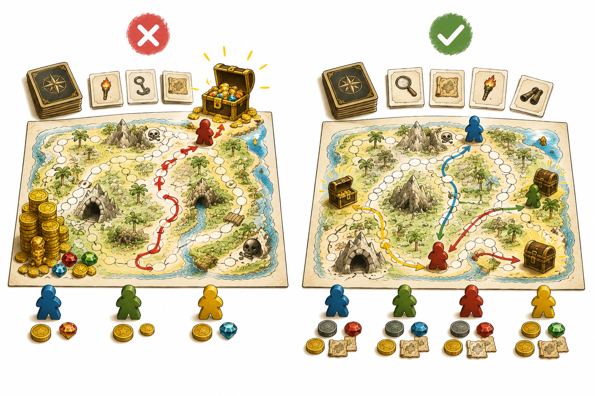
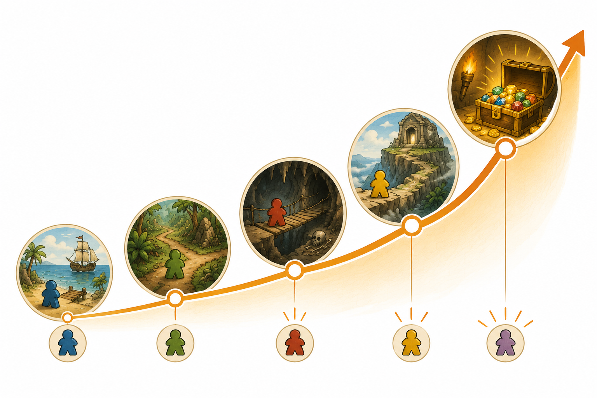

# Kapitel 8: Balans och speltempo

## Varför detta kapitel finns

När ett spel går att spela från början till slut kommer nästa stora fråga: känns det bra medan man spelar?

Ett spel kan ha tydliga regler men ändå kännas segt. Ett spel kan vara kort men ändå kännas orättvist. Ett spel kan vara fullt av val men ändå ha ett val som nästan alltid är bäst. Då behöver du arbeta med balans och speltempo.

I ett snabbspel är detta extra viktigt. När spelet ska ta under 30 minuter finns det inte plats för långa transportsträckor, väntan eller beslut som inte spelar någon roll. Varje runda behöver föra spelet framåt.

## Lärandemål

Efter kapitlet ska du kunna:

- förklara vad balans betyder i ett kort brädspel
- känna igen när ett speltempo är för långsamt eller för stressigt
- justera belöningar, risker och tidsgränser
- använda testdata utan att fastna i exakta siffror
- göra små ändringar som förbättrar spelet utan att skapa ett nytt spel

## Innan vi börjar

I förra kapitlet testspelade vi smart. Vi valde ett testmål, observerade spelare och samlade feedback.

Nu ska vi använda det vi såg. Men vi ska göra det försiktigt. Efter ett test är det lätt att vilja ändra allt på en gång. Gör inte det. Balansarbete handlar ofta om små justeringar, inte stora ombyggnader.

För Skattkartan betyder det att vi inte byter hela spelidén. Vi tittar på frågor som:

- Hinner spelarna hitta skatten innan tiden tar slut?
- Är det för farligt att utforska nya platser?
- Är det för enkelt att samla ledtrådar?
- Känns valet mellan att söka, utforska och vila meningsfullt?
- Tar spelet ungefär 20–30 minuter?

## Vad balans betyder

*Figur 8.1: Balans handlar om att olika spelare ska ha olika men jämförbara möjligheter.*

Balans betyder inte att allt är exakt lika starkt.

Balans betyder att spelets val, risker och möjligheter känns rimliga i förhållande till varandra. Spelarna ska kunna fatta olika beslut och ändå känna att de har en chans.

I ett nybörjarspel kan du tänka på tre sorters balans:

- balans mellan spelare
- balans mellan handlingar
- balans mellan risk och belöning

Balans mellan spelare betyder att ingen spelare får ett orimligt stort försprång bara för att de råkar börja först eller dra ett visst kort.

Balans mellan handlingar betyder att flera handlingar faktiskt är användbara. Om alla alltid väljer samma handling finns det troligen för lite intressant val.

Balans mellan risk och belöning betyder att farliga val ska kunna löna sig, men inte vara automatiskt bäst.

I Skattkartan kan det till exempel vara obalanserat om den bästa strategin alltid är att bara utforska så snabbt som möjligt och aldrig vila. Då finns vilohandlingen i reglerna, men inte i spelet.

## Vad speltempo betyder

*Figur 8.2: En kort spelomgång kan bygga spänning genom tydliga steg från start till sista skatt.*

Speltempo handlar om hur snabbt spelet rör sig framåt.

Tempo är inte samma sak som speltid. Ett spel kan ta 25 minuter och ändå kännas långsamt om spelarna väntar mycket eller gör många ointressanta val. Ett annat spel kan ta lika lång tid men kännas snabbt eftersom något viktigt händer nästan varje runda.

Ett bra tempo i ett kort äventyrsspel innebär ofta att:

- spelarna snabbt förstår vad de försöker göra
- varje tur innehåller ett tydligt val
- spelet ger ny information regelbundet
- slutet närmar sig synligt
- väntetiden mellan spelarnas turer är kort

Skattkartans tidsmätare hjälper med tempo. Den visar att äventyret inte kan pågå hur länge som helst. Men tidsmätaren behöver vara lagom. Om den går för snabbt känns spelet hopplöst. Om den går för långsamt försvinner spänningen.

## Mät utan att göra det krångligt

Du behöver inte avancerad statistik för att balansera ditt första spel. Börja med enkla observationer.

Efter varje testomgång kan du skriva ner:

| Fråga | Svar |
|---|---|
| Hur lång tid tog spelet? | |
| Vem vann, eller lyckades spelarna? | |
| Hur nära var slutet? | |
| Vilka handlingar användes ofta? | |
| Vilka handlingar användes sällan? | |
| När verkade spelarna mest engagerade? | |
| När tappade spelet fart? | |

Det viktiga är inte en enskild siffra. Det viktiga är mönster över flera tester.

Om ett test tar 35 minuter behöver du inte omedelbart kapa halva spelet. Kanske berodde det på att reglerna var nya. Men om tre test i rad tar 40 minuter trots att spelarna förstår reglerna, då behöver du justera.

## Justera en sak i taget

Den viktigaste regeln i balansarbete är enkel:

> Ändra så lite som möjligt mellan två testomgångar.

Om du ändrar kartan, korten, tidsmätaren och poängsystemet samtidigt vet du inte vilken ändring som hjälpte.

Välj hellre en liten ändring.

Exempel:

- Minska antalet platser från 12 till 10.
- Låt tidsmätaren gå framåt vartannat varv i stället för varje varv.
- Gör vilohandlingen lite starkare.
- Ta bort ett farokort som stoppar spelaren helt.
- Gör ledtrådarna tydligare.

För Skattkartan kan ett första balansproblem vara att spelet tar för lång tid. Då finns flera möjliga lösningar, men de påverkar spelet olika.

| Problem | Möjlig ändring | Risk |
|---|---|---|
| Spelet tar för lång tid | Färre platser på kartan | Spelet kan kännas för litet |
| Spelare hittar för få ledtrådar | Sök ger oftare ledtråd | Spelet kan bli för enkelt |
| Faror bromsar för mycket | Farokort blir mildare | Spänningen kan minska |
| Slutet kommer för sent | Tidsmätaren går snabbare | Spelet kan kännas stressigt |

Det finns sällan en perfekt lösning direkt. Du väljer en hypotes, ändrar, testar och lär dig.

## Balans i Skattkartan

Låt oss anta att första testet av Skattkartan gav dessa observationer:

- Spelet tog 38 minuter.
- Spelarna förstod målet.
- Utforska användes nästan varje tur.
- Vila användes bara en gång.
- Flera spelare tyckte att farokorten stoppade spelet för hårt.
- Skatten hittades först mycket sent.

Det betyder inte att spelet är dåligt. Det betyder att spelet har börjat visa vad det behöver.

En rimlig första tolkning är:

- kartan är kanske lite för stor
- vila är för svag eller behövs för sällan
- farorna skapar stopp snarare än spänning
- ledtrådarna kommer för långsamt

Men vi ska inte ändra allt. Till nästa version kan vi välja tre små justeringar:

1. Minska kartan från 12 platser till 10.
2. Ändra ett farokort så att det kostar tid i stället för att stoppa spelarens nästa tur.
3. Låt spelaren som vilar ta bort en fara eller få en liten fördel inför nästa risk.

Nu har vi en tydlig version 2. Den är fortfarande samma spel, men med bättre chans att hålla rätt tempo.

## När snabbare inte alltid är bättre

Eftersom boken fokuserar på spel under 30 minuter kan det vara frestande att göra allt snabbare. Men ett spel får inte bara rusa.

Spelaren behöver hinna:

- förstå situationen
- känna osäkerhet
- fatta ett val
- se konsekvensen av valet

Om allt händer för snabbt kan spelet kännas slumpmässigt. Då hinner inte spelarna bry sig om besluten.

Målet är alltså inte maximal hastighet. Målet är meningsfullt tempo. Spelet ska röra sig framåt utan att köra över spelarnas upplevelse.

I Skattkartan vill vi att spelarna ska känna: “Vi hinner kanske, men bara om vi väljer smart.” Det är en bättre känsla än både “Det här är omöjligt” och “Vi har hur mycket tid som helst.”

## Vanliga misstag

- **Misstag: Att balansera efter en enda spelares åsikt.**
  - Varför det händer: En tydlig kommentar kan kännas mer sann än flera tysta observationer.
  - Hur man undviker det: Skriv ner vad som faktiskt hände och jämför över flera tester.

- **Misstag: Att göra stora ändringar efter varje test.**
  - Varför det händer: Man vill snabbt laga allt som verkar fel.
  - Hur man undviker det: Välj högst tre ändringar, gärna färre.

- **Misstag: Att tro att rättvisa betyder likadana val.**
  - Varför det händer: Det känns tryggt när allt är jämnt.
  - Hur man undviker det: Låt val vara olika, men se till att flera val kan vara bra i rätt situation.

- **Misstag: Att kapa bort all friktion.**
  - Varför det händer: Problem i spelet upplevs som något som alltid ska tas bort.
  - Hur man undviker det: Skilj på dålig friktion och bra spänning. Ett hinder kan vara roligt om spelaren kan påverka det.

## Övningar

### Övning 1: Mät en spelomgång

Testa ditt spel eller Skattkartan och skriv ner:

| Mätpunkt | Resultat |
|---|---|
| Total speltid | |
| Antal rundor | |
| Vanligaste handling | |
| Minst använda handling | |
| Mest spännande ögonblick | |
| Långsammaste ögonblick | |

Skriv sedan en mening: “Spelet känns för långsamt, för snabbt eller lagom därför att ...”

### Övning 2: Hitta ett svagt val

Välj en handling, ett kort eller en regel som spelarna sällan använder.

Svara på tre frågor:

1. Förstår spelarna att valet finns?
2. Är valet för svagt jämfört med alternativen?
3. Behövs valet egentligen i spelet?

Välj sedan en liten ändring som gör valet tydligare, starkare eller enklare.

### Övning 3: Justera Skattkartan

Utgå från följande problem:

> Spelarna hinner nästan aldrig hitta skatten innan tiden tar slut.

Välj en av dessa lösningar och motivera ditt val:

- färre platser på kartan
- fler ledtrådar
- mildare farokort
- långsammare tidsmätare

Skriv också vilken risk din lösning kan skapa.

### Fördjupning: Testa två versioner

Skapa två nästan likadana versioner av en regel.

Exempel:

- Version A: Vila ger spelaren ett skydd mot nästa fara.
- Version B: Vila flyttar inte tidsmätaren framåt.

Testa båda versionerna kort och skriv vilken som gav bäst speltempo.

## Snabb sammanfattning

- Balans betyder att spelets val, risker och möjligheter känns rimliga.
- Speltempo handlar om hur spelet rör sig framåt, inte bara om minuter.
- I snabbspel bör nästan varje tur bidra till målet, spänningen eller informationen.
- Mät enkelt: speltid, rundor, använda handlingar och tappad fart.
- Ändra lite i taget så att du vet vad som faktiskt påverkade spelet.
- Skattkartan bör justeras med små ändringar i karta, faror, ledtrådar och tidsmätare.

## Quiz/reflektionsfrågor

1. Vad är skillnaden mellan balans mellan spelare och balans mellan handlingar?
2. Varför kan ett spel på 25 minuter ändå kännas långsamt?
3. Varför är det riskabelt att ändra många saker mellan två test?
4. Vilken del av Skattkartan påverkar tempot mest: kartans storlek, farokorten eller tidsmätaren? Motivera.
5. När kan ett hinder i spelet vara bra även om det gör spelet svårare?

## Nästa steg

Nu har vi börjat förbättra spelets känsla. I nästa kapitel tittar vi på vad du gör när spelet fortfarande inte fungerar: när regler skaver, spelare blir passiva, temat inte hjälper eller hela idén behöver förenklas.
