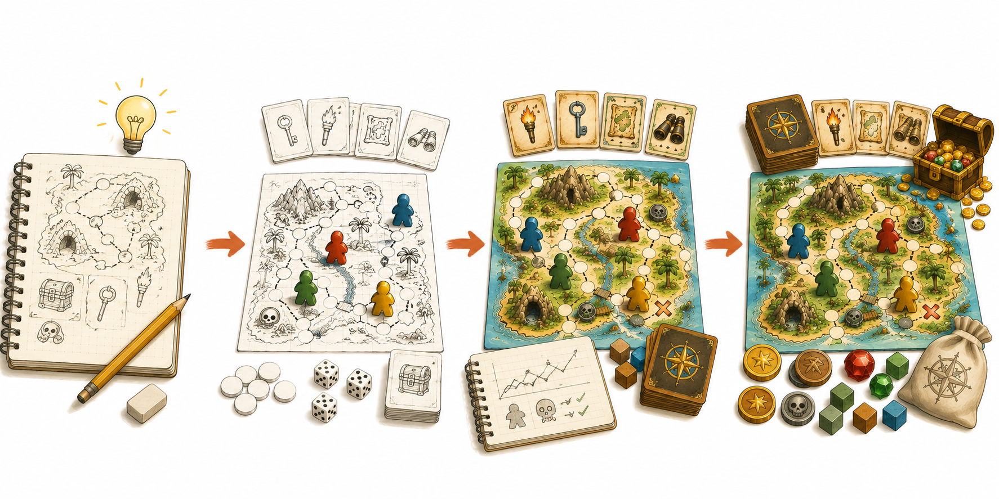

# Kapitel 11: Från prototyp till färdigt spel

## Varför detta kapitel finns

Nu har du gjort det som många aldrig kommer fram till: du har en spelbar prototyp som har testats, justerats och börjat få en tydlig form. Det är en stor sak.

Men en fungerande prototyp är inte riktigt samma sak som ett färdigt spel. Prototypen visar att idén kan fungera. Ett färdigt spel ska dessutom vara lätt att lära ut, lätt att spela om och tillräckligt stabilt för att andra ska kunna spela utan att du står bredvid och förklarar varje detalj.

I det här kapitlet ska vi ta steget från "det fungerar när jag visar det" till "det fungerar när andra spelar det själva". Det är här spelet blir mer självständigt.

## Lärandemål

Efter kapitlet ska du kunna:

- skilja mellan prototyp, sen prototyp och färdigt spel
- avgöra vilka ändringar som bör göras före slutversionen
- skapa en enkel slutchecklista för regler, komponenter och speltempo
- genomföra ett sista test utan att styra spelarna
- förbereda Skattkartan för en första färdig version

## Innan vi börjar

I tidigare kapitel har du arbetat med spelidé, kärna, regler, prototyp, testspelning, balans, problemlösning och presentation.

Nu ska vi samla ihop allt.

Frågan är inte längre bara:

> "Kan spelet fungera?"

Frågan är nu:

> "Kan spelet fungera tydligt och pålitligt för andra?"

Det är en annan nivå av färdighet, men du behöver fortfarande inte göra spelet perfekt. Målet är en första färdig version, inte en kommersiell lyxutgåva.

## Tre nivåer av färdighet

*Figur 11.1: Ett spel blir färdigt stegvis: idé, prototyp, testad version och färdig hemmaversion.*

Det hjälper att se spelet i tre nivåer.

| Nivå | Syfte | Typiskt tecken |
|---|---|---|
| Tidig prototyp | Testa om idén har potential | Du ändrar regler ofta |
| Sen prototyp | Testa om spelet håller ihop | Du ändrar detaljer, inte hela spelet |
| Första färdiga version | Låta andra spela utan dig | Regler och komponenter är begripliga utan muntlig hjälp |

Många nybörjare försöker hoppa direkt från tidig prototyp till färdigt spel. Då blir resultatet ofta snyggt men ostadigt.

Ett bättre mål är att först skapa en sen prototyp. Den behöver inte se fantastisk ut, men den ska vara konsekvent, testbar och begriplig.

## Vad betyder "färdigt" i den här boken?

I den här boken betyder färdigt inte att spelet är redo för butik, tryckeri eller massproduktion.

Färdigt betyder:

- spelet har en tydlig målbild
- reglerna kan läsas och följas av nya spelare
- komponenterna räcker för att spela utan improvisation
- spelet håller ungefär den tänkta speltiden
- de största kända problemen är lösta eller medvetet accepterade
- du kan visa spelet för andra utan att ursäkta det hela tiden

Det sista är viktigt. Många skapare fastnar i att säga "det här är bara en prototyp" långt efter att spelet faktiskt går att spela. En första färdig version får fortfarande vara enkel. Den behöver bara vara ärlig och spelbar.

## Sluta ändra allt samtidigt

När spelet närmar sig slutversion blir varje ändring dyrare.

Tidigt i processen kan du byta mål, turordning, komponenter och poängsystem på samma eftermiddag. Sent i processen bör du vara försiktigare.

En bra regel är:

> I slutfasen ändrar du hellre en sak tydligt än fem saker halvt.

Om Skattkartan fortfarande känns för långsam kan vi till exempel välja ett huvudspår:

- minska kartan
- minska antalet ledtrådar som krävs
- göra farokorten mindre straffande
- öka spelarnas rörelse

Alla kan påverka tempot. Men om vi ändrar alla samtidigt vet vi inte vilken ändring som hjälpte.

## Skattkartans slutmål

För Skattkartan kan en första färdig version ha detta mål:

> Ett äventyrligt kartspel för 2–4 spelare där varje spelare utforskar en liten ö, samlar ledtrådar, tar risker vid farliga platser och försöker hitta skatten och återvända till lägret innan tiden tar slut.

Det är inte långt, men det hjälper oss att fatta slutbeslut.

Om en regel inte stödjer utforskning, ledtrådar, risk, skattjakt eller tidspress behöver den antagligen förenklas eller tas bort.

## Slutchecklista för regler

Reglerna är ofta den viktigaste delen att färdigställa. Ett spel med enkla komponenter kan kännas färdigt om reglerna är tydliga. Ett spel med snygga komponenter känns ofärdigt om reglerna är röriga.

Gå igenom regeltexten med den här checklistan:

| Kontrollfråga | Varför den behövs |
|---|---|
| Förstår spelarna målet inom en minut? | Annars börjar spelet utan riktning |
| Är uppställningen tydlig? | Annars blir starten osäker |
| Vet spelaren vad hen får göra på sin tur? | Annars fastnar spelet |
| Står det när spelet slutar? | Annars uppstår diskussion |
| Står det hur vinnaren avgörs? | Annars blir slutet svagt |
| Finns exempel på svåra situationer? | Annars måste du förklara muntligt |

För Skattkartan bör reglerna särskilt förklara:

- hur kartan läggs fram
- hur spelarna rör sig
- hur ledtrådar samlas
- när farokort dras
- hur tidsspåret fungerar
- vad som krävs för att hitta skatten
- hur spelet vinns eller förloras

## Slutchecklista för komponenter

När reglerna är begripliga behöver komponenterna stödja dem.

Fråga:

- Finns alla komponenter som reglerna nämner?
- Har varje kort eller bricka samma format där det behövs?
- Är symboler, färger och namn konsekventa?
- Kan spelarna se viktig information utan att fråga?
- Finns det onödiga komponenter som kan tas bort?
- Är komponenterna tillräckligt tåliga för några testomgångar till?

I Skattkartan kan slutversionen fortfarande vara enkel:

| Komponent | Första färdiga version |
|---|---|
| Karta | En tydlig ö med 10–12 platser |
| Spelarpjäser | En markör per spelare |
| Ledtrådskort | Enkel text eller symbol |
| Farokort | Kort riskhändelse och tydlig effekt |
| Tidsspår | 12–15 steg beroende på testresultat |
| Skattmarkör | Visar när skatten har hittats |
| Referenskort | Påminner om turens steg |

Referenskortet är ofta en liten men stark förbättring. Det gör att spelarna inte behöver leta i reglerna varje tur.

## Det sista testet: låt spelet klara sig själv

När du tror att spelet är nära färdigt bör du göra ett test där du inte hjälper spelarna mer än nödvändigt.

Det kan kännas svårt. Man vill gärna förklara, rädda situationer och säga "egentligen menar jag så här". Men just därför är testet värdefullt.

Gör så här:

1. Ge spelarna reglerna och komponenterna.
2. Be dem läsa och försöka starta själva.
3. Svara bara på frågor om de verkligen kör fast.
4. Anteckna varje fråga de ställer.
5. Anteckna varje gång de tolkar reglerna på ett annat sätt än du tänkt.
6. Fråga efteråt vad som var oklart, segt eller roligt.

Det här testet visar inte bara om spelet fungerar. Det visar om spelet kommunicerar.

## När ska du sluta putsa?

Det finns alltid mer att förbättra. Alltid.

Du kan byta ikonstil, skriva om en mening, justera ett kort, testa en ny poängregel eller fundera på om kartan borde ha elva platser i stället för tolv.

Därför behöver du en stoppregel.

Exempel på en bra stoppregel:

> "När tre testgrupper i rad kan spela spelet utan stora regelproblem och speltiden ligger under 30 minuter, gör jag en första färdig version."

Stoppregeln hjälper dig att avsluta en fas. Den hindrar dig inte från att göra en bättre version senare.

## Vanliga misstag

- **Att göra spelet snyggt innan det är stabilt.** Det gör varje ändring långsammare och mer känslomässigt jobbig.
- **Att lägga till nytt innehåll i slutet.** Nya kort, förmågor och undantag skapar ofta nya problem.
- **Att ignorera små regelmissförstånd.** Om flera spelare missförstår samma sak är det inte ett spelarproblem, utan ett kommunikationsproblem.
- **Att aldrig bestämma en slutpunkt.** Utan stoppregel kan ett litet spel förbli "nästan klart" hur länge som helst.
- **Att försöka göra första spelet till sitt drömspel.** Första färdiga versionen ska lära dig processen, inte bevisa allt du kan.

## Övningar

### Övning 1: Skriv din färdig-definition

Skriv tre till sex punkter som beskriver när ditt spel får kallas "första färdiga version".

Exempel:

- Reglerna kan förstås utan min muntliga förklaring.
- Spelet tar högst 30 minuter.
- Minst två nya testgrupper har spelat det.
- De största kända problemen är lösta.
- Komponenterna är tydliga nog för upprepat spel.

### Övning 2: Gör en slutchecklista

Skapa en egen checklista med tre rubriker:

- Regler
- Komponenter
- Spelupplevelse

Skriv minst fem kontrollfrågor under varje rubrik.

### Övning 3: Planera ett självständigt test

Planera ett test där du inte lär ut spelet muntligt från början.

Skriv:

- vilka som ska testa
- vad de får för material
- vad du ska observera
- vilka frågor du ska ställa efteråt

### Fördjupning: Gör en version 1.0-sida

Skriv en kort sida för ditt spel med:

- titel
- antal spelare
- ungefärlig speltid
- mål
- kort beskrivning
- komponentlista
- vad som gör spelet roligt

Det här blir en enkel presentationssida för din första färdiga version.

## Snabb sammanfattning

- En prototyp testar om idén fungerar.
- En sen prototyp testar om spelet håller ihop.
- En första färdig version ska kunna spelas av andra utan att du styr allt.
- I slutfasen bör du ändra få saker åt gången.
- Regler, komponenter och spelupplevelse behöver en sista genomgång.
- Ett självständigt test visar om spelet kommunicerar tydligt.
- En stoppregel hjälper dig att faktiskt avsluta versionen.

## Reflektionsfrågor

1. Vad måste vara sant för att du ska våga kalla ditt spel färdigt i första version?
2. Vilken del av ditt spel är mest beroende av att du förklarar muntligt?
3. Vilken komponent kan göra spelet tydligare utan att lägga till nya regler?
4. Vilken ändring bör du undvika just nu, även om den känns lockande?
5. Vad skulle vara en rimlig stoppregel för ditt spel?

## Nästa steg

Nu har du gått från idé till en första färdig version. I nästa kapitel lyfter vi blicken: hur du kan fortsätta som speldesigner, hitta fler testspelare, utveckla nya idéer och eventuellt ta ett spel vidare mot publicering eller delning med andra.
