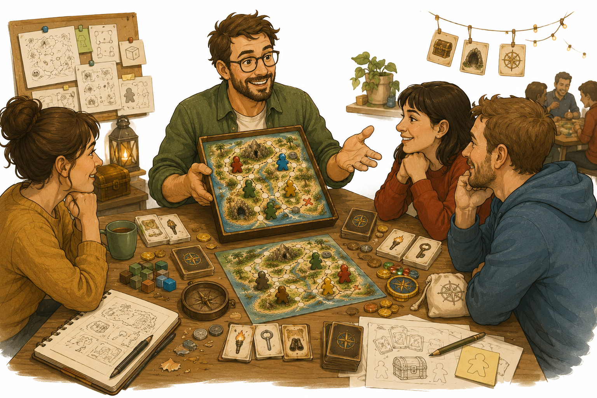

# Kapitel 12: Nästa steg som speldesigner

## Varför detta kapitel finns

Du har nu gått igenom hela vägen från första spelidé till en första färdig version. Det betyder inte att du är "klar" med speldesign. Det betyder något bättre: du har gjort din första hela designresa.

Många börjar med idéer. Färre bygger prototyper. Ännu färre testar, ändrar, skriver regler och gör en version som andra faktiskt kan spela. Om du har följt övningarna i boken har du redan gjort det viktigaste en ny speldesigner kan göra: du har förvandlat en vag tanke till något spelbart.

Det här sista kapitlet hjälper dig ta nästa steg. Du ska få syn på vad du har lärt dig, hur du kan fortsätta utveckla Skattkartan och hur du kan börja skapa fler egna spel utan att fastna i för stora projekt.

## Lärandemål

Efter kapitlet ska du kunna:

- sammanfatta vad du har lärt dig genom att skapa ett eget snabbspel
- planera en enkel fortsättning för Skattkartan eller ett nytt spelprojekt
- hitta bättre testspelare och använda feedback mer moget
- bygga en personlig designrutin som går att hålla över tid
- förstå skillnaden mellan hobbyprojekt, portföljspel och publiceringsambition

## Innan vi börjar

I föregående kapitel gjorde du spelet redo för en första färdig version. Det innebar inte perfektion. Det innebar att spelet kunde stå mer på egna ben.

Nu byter vi perspektiv.

Tidigare frågor har varit:

- Fungerar spelet?
- Förstår spelarna reglerna?
- Är tempot rätt?
- Är komponenterna tillräckligt tydliga?

Nu blir frågan:

> Vad vill jag göra med det jag har lärt mig?

Det finns inget enda rätt svar. Du kan fortsätta som hobbydesigner, göra fler små spel, förbättra Skattkartan, visa spelet för vänner, delta i spelträffar eller börja undersöka publicering. Poängen är att välja ett nästa steg som passar dig.

## Du har byggt en designprocess

Det viktigaste resultatet av boken är inte bara Skattkartan. Det viktigaste är processen du nu har övat på.

Den kan sammanfattas så här:

1. Börja med en liten spelidé.
2. Välj ett tydligt mål för spelaren.
3. Hitta en enkel kärnmekanik.
4. Skriv regler som går att testa.
5. Bygg en ful men spelbar prototyp.
6. Testspela och observera.
7. Justera ett problem i taget.
8. Förbättra tempo, balans och presentation.
9. Skapa en första färdig version.
10. Reflektera och välj nästa steg.

Det här är en process du kan använda igen och igen. Nästa gång går den inte nödvändigtvis snabbare i varje steg, men du kommer känna igen problemen tidigare.

## Tre vägar vidare

*Figur 12.1: Efter första spelet kan du fortsätta skapa, testa och dela spel med andra.*

Efter ett första spel finns det oftast tre naturliga vägar.

| Väg | Passar dig som vill | Bra nästa steg |
|---|---|---|
| Förbättra samma spel | Göra Skattkartan tydligare, roligare eller mer stabilt | Planera en version 2 |
| Göra ett nytt litet spel | Träna bredd och testa nya mekaniker | Skapa ett spel på 18 kort eller 9 brickor |
| Dela spelet med andra | Få fler reaktioner och bygga självförtroende | Ordna ett blindtest eller spelkväll |

Ingen av vägarna är mer seriös än de andra. Att göra många små spel är ofta minst lika lärorikt som att arbeta länge med ett enda stort spel.

För nybörjare är det särskilt värdefullt att skapa flera små spel. Varje nytt spel tränar dig i att börja, begränsa, testa och avsluta.

## När ska du fortsätta med Skattkartan?

Det är lockande att genast göra nästa stora version av Skattkartan. Innan du gör det, ställ tre frågor:

- Vill testspelare spela igen?
- Finns det ett tydligt problem som fortfarande behöver lösas?
- Har du själv energi att fortsätta med just detta spel?

Om svaret är ja på minst två av frågorna kan en version 2 vara värd att göra.

En version 2 bör inte betyda "lägg till allt". Den bör betyda "gör den bästa delen tydligare".

För Skattkartan kan version 2 till exempel fokusera på ett av följande:

- mer intressanta vägval på kartan
- tydligare ledtrådskort
- bättre risk i farliga områden
- jämnare speltid
- enklare regler för nya spelare

Välj helst en huvudinriktning. Om du försöker förbättra allt samtidigt riskerar du att skapa ett nytt otydligt spel.

## När ska du göra ett nytt spel?

Ibland är det bättre att avsluta ett spel och göra något nytt. Det betyder inte att det gamla spelet misslyckades.

Du kan göra ett nytt spel när:

- du har lärt dig det du ville lära dig
- spelet fungerar tillräckligt bra för sitt syfte
- du märker att du bara lägger till saker för att slippa avsluta
- du vill träna en annan mekanik
- du har en liten idé som går att testa snabbt

Ett bra andra projekt bör vara mindre än du tror.

Exempel på små designutmaningar:

- ett kortspel med exakt 18 kort
- ett spel som bara använder tärningar och papper
- ett samarbetsspel på högst 15 minuter
- ett bluffspel utan spelbräde
- ett spel där alla regler ryms på en sida

Sådana begränsningar gör dig mer kreativ. De tvingar dig att välja bort, och att välja bort är en av speldesignerns viktigaste färdigheter.

## Bygg din egen designrutin

Speldesign blir lättare om du gör det till en återkommande vana i stället för ett stort projekt som kräver perfekt inspiration.

En enkel designrutin kan se ut så här:

| Tillfälle | Aktivitet | Tidsåtgång |
|---|---|---|
| Vecka 1 | Skriv tre små spelidéer | 30 minuter |
| Vecka 2 | Välj en idé och gör en pappersprototyp | 60 minuter |
| Vecka 3 | Testspela med en eller två personer | 30–60 minuter |
| Vecka 4 | Justera och skriv en kort regelversion | 60 minuter |

Det viktiga är inte exakt schema. Det viktiga är att processen har en rytm: idé, prototyp, test, förbättring.

Om du bara samlar idéer blir inget spel färdigt. Om du bara förbättrar utan att testa vet du inte om förbättringen hjälper. Om du bara testar utan att ändra händer inget nytt.

## Hitta bättre feedback

När du fortsätter designa behöver du fler typer av feedback.

Vänner och familj är ofta bra i början. De hjälper dig våga testa. Men efter ett tag behöver du också personer som kan säga tydligare saker.

Försök samla feedback från tre typer av spelare:

- **Vänliga nybörjare** som visar om spelet är begripligt.
- **Ärliga hobbyspelare** som kan jämföra med andra spel.
- **Tysta observatörer** där du själv ser vad som händer utan att de förklarar allt.

Kom ihåg att feedback inte är en order. Om en spelare säger "lägg till fler kort" kan den verkliga signalen vara att spelet saknar variation. Då kan lösningen vara fler kort, men den kan också vara bättre kartval, tydligare risk eller kortare speltid.

Lyssna efter problemet bakom förslaget.

## Blindtest: nästa stora milstolpe

Ett blindtest är när andra spelar spelet utan att du lär ut det muntligt. De får bara reglerna och komponenterna.

Det är svårt, men mycket lärorikt.

Förbered ett enkelt blindtest så här:

1. Lägg fram spelets komponenter.
2. Ge spelarna reglerna.
3. Säg bara: "Försök spela utan min hjälp."
4. Sitt tyst och anteckna.
5. Markera varje plats där de tvekar, tolkar fel eller ställer frågor.
6. Fråga efteråt vad de trodde spelet handlade om.

Målet är inte att bevisa att spelet är färdigt. Målet är att upptäcka vad reglerna och komponenterna inte förklarar på egen hand.

För Skattkartan kan ett blindtest visa om spelare förstår:

- hur de rör sig på kartan
- hur ledtrådar fungerar
- när farokort dras
- hur spelet tar slut
- hur vinnaren utses

Om de fastnar på samma ställe flera gånger är det inte spelarnas fel. Då har du hittat en förbättringspunkt.

## Hobbyprojekt, portföljspel eller publicering?

Alla spel behöver inte publiceras. Det är värt att säga tydligt.

Ett spel kan ha olika syften:

| Syfte | Vad det betyder |
|---|---|
| Hobbyprojekt | Du gör spelet för glädje, lärande och spelkvällar |
| Portföljspel | Du gör spelet för att visa vad du kan som designer |
| Publiceringsprojekt | Du utvecklar spelet med målet att nå en bredare publik |

Dessa syften kräver olika mycket arbete.

Ett hobbyprojekt kan vara lyckat om fem personer har roligt runt ett köksbord. Ett portföljspel behöver vara tydligt nog att visa för andra designers. Ett publiceringsprojekt kräver mer testning, produktionskunskap, målgruppstänk och ofta extern granskning.

Det är klokt att inte börja med publicering som enda mått på framgång. Första målet är att bli bättre på design.

## Din personliga designlogg

Ett enkelt sätt att utvecklas är att föra designlogg. Den behöver inte vara avancerad.

Efter varje test eller arbetspass kan du skriva:

- Vad testade jag?
- Vad fungerade?
- Vad fungerade inte?
- Vilken ändring gör jag härnäst?
- Vad ska jag inte ändra just nu?

Den sista frågan är viktig. En designlogg hjälper dig inte bara komma ihåg idéer. Den hjälper dig också undvika att ändra allt samtidigt.

För Skattkartan kan en loggrad se ut så här:

| Datum | Observation | Beslut |
|---|---|---|
| Test 4 | Spelarna gillade farliga grottan men glömde tidsmätaren | Gör tidsmätaren mer synlig, ändra inte farokorten än |

Det här är enkel dokumentation, men den gör stor skillnad när spelet växer.

## Vanliga misstag

- **Misstag: Att aldrig avsluta första spelet.**
  - Varför det händer: Det känns tryggare att förbättra än att säga "det här är version 1".
  - Hur man undviker det: Sätt ett slutmål: en regelversion, ett blindtest eller en spelkväll där spelet spelas som färdig version.

- **Misstag: Att tolka all feedback bokstavligt.**
  - Varför det händer: Spelare föreslår ofta lösningar i stället för att beskriva problem.
  - Hur man undviker det: Fråga vad upplevelsen var, inte bara vad de tycker du ska lägga till.

- **Misstag: Att göra nästa projekt för stort.**
  - Varför det händer: Efter ett färdigt spel får man självförtroende och vill skapa något episkt.
  - Hur man undviker det: Gör nästa projekt ännu mindre än det första, men med en ny lärdom.

- **Misstag: Att jämföra sin prototyp med publicerade spel.**
  - Varför det händer: Färdiga spel ser enkla ut eftersom allt utvecklingsarbete är osynligt.
  - Hur man undviker det: Jämför i stället med din egen tidigare version.

## Övningar

### Övning 1: Skriv din designsammanfattning

Skriv en halv sida om ditt spel.

Svara på:

1. Vad heter spelet?
2. Vilka är spelarna i spelets värld?
3. Vad försöker de göra?
4. Vilken är spelets viktigaste mekanik?
5. Vad gör spelet spännande?
6. Vad är du mest nöjd med?
7. Vad skulle du vilja förbättra i version 2?

Målet är att kunna beskriva spelet tydligt utan att börja förklara alla regler.

### Övning 2: Välj nästa väg

Välj en av dessa tre vägar:

- förbättra Skattkartan
- göra ett nytt litet spel
- dela spelet med fler testspelare

Skriv sedan:

- varför du väljer den vägen
- vad första konkreta steget är
- vad som räknas som "klart" för nästa steg

### Övning 3: Planera ett blindtest

Gör en enkel blindtestplan.

Fyll i:

| Del | Ditt svar |
|---|---|
| Vilka ska testa? | |
| Vad får de för material? | |
| Vad får du inte förklara muntligt? | |
| Vad ska du observera? | |
| Vilka frågor ställer du efteråt? | |

### Fördjupning: Designa ett mikospel

Skapa en idé till ett helt nytt spel med dessa begränsningar:

- högst 18 kort
- högst 15 minuters speltid
- inga specialregler som bara gäller ett enda kort
- reglerna ska rymmas på en sida

Du behöver inte göra spelet färdigt. Målet är att träna på små, tydliga designramar.

## Snabb sammanfattning

- Det viktigaste du har byggt är inte bara ett spel, utan en designprocess.
- Efter första spelet kan du förbättra samma spel, göra ett nytt litet spel eller dela spelet med fler.
- Små projekt är ett utmärkt sätt att bli bättre snabbt.
- Feedback ska hjälpa dig hitta problem, inte styra alla lösningar.
- Blindtest är en viktig milstolpe när spelet ska kunna förstås utan dig.
- Alla spel behöver inte publiceras; hobbyprojekt och lärprojekt är också värdefulla.
- En enkel designlogg gör det lättare att se vad som faktiskt förändras.

## Reflektionsfrågor

1. Vad har du lärt dig om spel som du inte tänkte på innan du började?
2. Vilken del av designprocessen tyckte du var roligast?
3. Vilken del var svårast?
4. Vilken typ av spel vill du testa att skapa härnäst?
5. Vad skulle göra dig stolt över Skattkartan, även om det aldrig publiceras?

## Nästa steg

Boken slutar här, men din designprocess behöver inte göra det.

Välj ett enda nästa steg:

- boka ett blindtest
- skriva rent reglerna
- göra en version 2 av Skattkartan
- skapa ett mikospel
- bjuda in till en spelkväll
- starta en designlogg

Gör steget litet nog att det faktiskt blir av.

Det är så brädspel blir skapade: inte genom den perfekta idén, utan genom nästa spelbara version.
